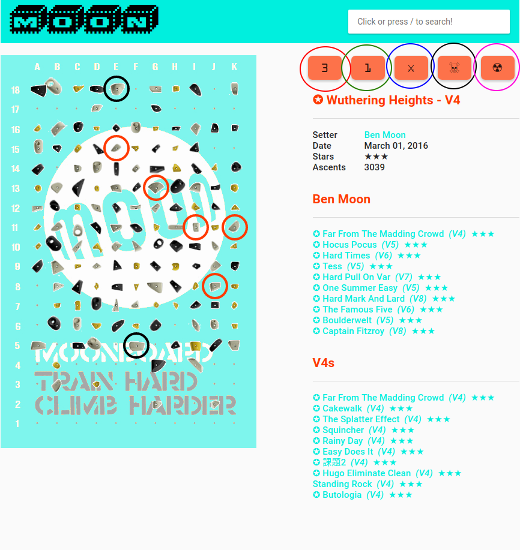

MOOn
====
MOOn is a web app for the [MoonBoard](https://www.moonboard.com) that is designed to function in an offline environment.  The 2019 Masters set (40 degree board) is hosted at https://moon2019.zombull.xyz.  The 2017 Masters set (40 degree board) is hosted at https://moon2017.zombull.xyz.  The 2016 set can be found at https://moon2016.zombull.xyz.

The web app should work in any desktop browser as well as any relatively recent mobile browser/OS, though it's only been tested on an old iPad and a very new Android phone.  The search bar functionality is kludgy on Android (Angular issue?); if it's being stupid just reload the home page.

Feel free to submit issue if you run into problems (especially if the formatting looks weird on your phone), have questions, etc...

Google Drive
============

Google Drive is used to synchronize ticks/projects across multiple devices.  You'll be prompted to login to Google (if you're not already logged in); amusingly, Chrome blocks the popup that Google Drive displays for the login and approval, so you may need to manually allow the login popup.

Once you're logged in, Google Drive will display a warning that the app is not verified (lot's of hoops to jump through).  Click the ["Advanced"](readme/advanced.png) link and then ["Go to zombull.xyz (unsafe)"](readme/goto.png).  You should then see a prompt asking whether or not you want to grant zombull.xyz access to files/folder it creates (this won't give access to your other files/folders), and to view your file metadata (this is needed to query whether or not the app's data file exists).  Click the ["Allow"](readme/allow.png) button.  The app only needs to be approved once across all devices, and you shouldn't see any popup so long as you stay logged in to your Google account.  The app will work if it doesn't have access to Google Drive, but you'll get nagged once per day and your projects/ticks won't get synchronized across devices (and aren't 100% guaranteed to be preserved on your local device).

Data is stored in Google Drive in a file named zombull.moonboard.<year>.userdata.json.  You can delete/download the file, but you can't modify it directly (Google Drive has weird permissions).  Delete this file (e.g. via Google Drive web interface) to purge your projects/ticks.  Google Drive has a trash so you can restore the file in case you accidentally delete it.

All data is cached locally.  Once loaded the app will work even without a network connection unless you reload the page or directly change the URL.  Pending updates to projects/ticks are also cached/tracked if the app can't communicate with Google Drive, though until they are pushed to Google Drive they only exist on your current device.  Pending updates are pushed to Google Drive on the next reload.  Pulling from Google Drive, e.g. if you added a project/tick via a different device, also occurs on reload.  When in doubt, reload :-)

Links
=====

Almost all text that isn't black is a link to something else, e.g. to the problem, the setter, grade, etc...

Search
======

The search bar is a live search of all problems in the current scope.  The scope is determined by the page you are on, e.g. on the landing page, all problems are in scope; on the ticks page only ticks are in scope, etc...  Unless there is only a single result the top entry in the search results will be *** Browse Results ***, which is hopefully self-explanatory.  Browsing results also redefines scope, i.e. you can incrementally refine search results by browsing results and then updating the search query.  There are special commands that you can use in the search bar; a list of the various search commands can be found on the home page.  Any text that isn't a command will be used to search for matching problem names.

Problem Page
============
The problem page buttons aren't exactly obvious.  The following screenshot highlights each button with a different color:

  * _Red:_    Number of attempts, click to increase by one.
  * _Green:_  Number of sessions, click to increase by one.
  * _Blue:_   Tick the problem.  This will bring up a dialog box that you can modify the grade, stars, date, attempts and sessions, and confirm/cancel the tick. Everything except stars is filled in with defaults (suggested grade, current date, tracked attempts/sessions).
  * _Black:_   Exile the problem.  This will hide the problem in the browsing and searching views, e.g. problems you despise or have given up on.  Exiled problems can be explicitly found via search commands, and exile status can be reverted.  The number of attempts/sessions for a problem will be preserved if you exile the problem.
  * _Pink:_    Nuke.  For a non-exiled problem, this will reset the number of attempts/sessions.  There is a running 3 second delay when you increment attempts/sessions; hitting the nuke button in the 3 second window will reset attempts/sessions to the last stable state without a confirmation dialog.  For example, if attempts=17 and sessions=2, and you accidentally click attempts twice, i.e. attempts=19, hitting the nuke button in the three second window will revert attempts to 17.  If there is no pending attempts/sessions update, the nuke button will reset attempts and sessions to 0.  In this case there will be a confirmation dialog so you don't accidentally nuke a project.  For an exiled problem, use the nuke button to revert the exile status.

